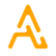
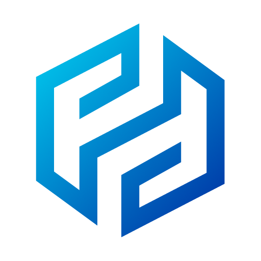
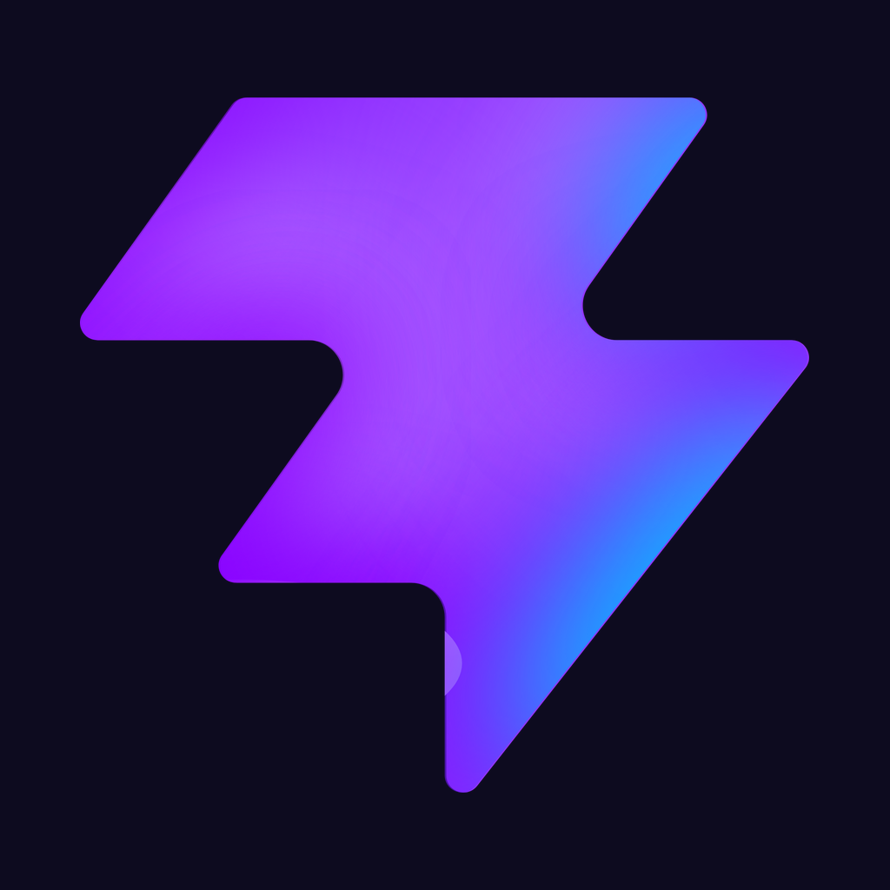
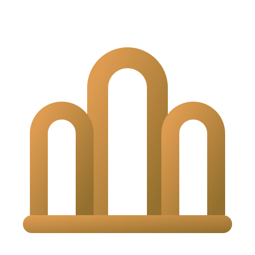
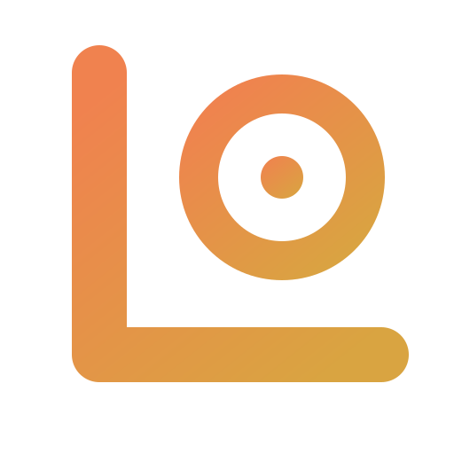
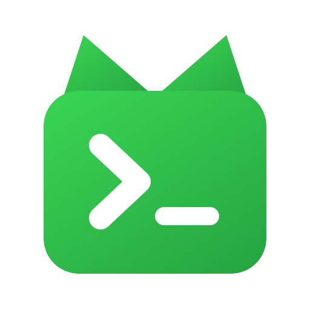
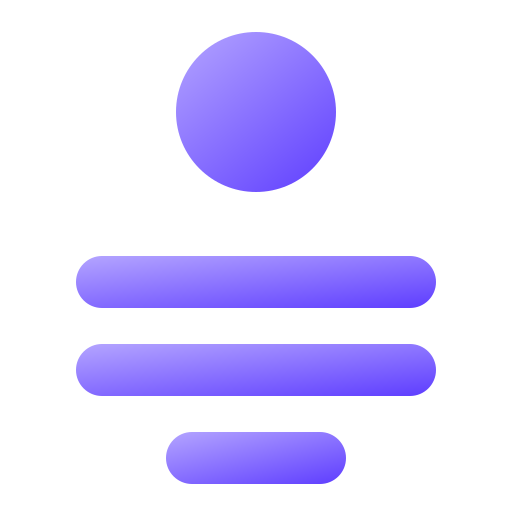
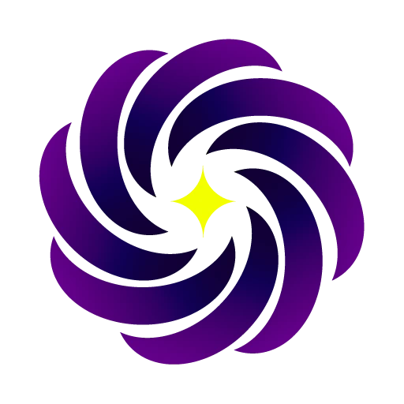

## `📌` About Me

`🚀` Founder of **VulCode** 
`🤝` Co-founder of **Aphrodi** 
`🎮` Co-founder of **Lunatic Studios** 
`🛠️` Lead dev & maintainer of **Spectra** 
`🧭` Lead dev & maintainer of **Hermeia** 
`🌍` Building a bit of everything &mdash; web, mobile, backend & systems 
`🌱` Currently going deeper into: **Rust**, **Elixir** & distributed systems 
`⚡` Fun fact: there are more possible chess games than atoms in the observable universe 

`📖` *"If you step out for the sun but hide from the rain, you never truly loved the sky."*

 

## `📫` Reach Me

`🐙` [GitHub](https://github.com/VulCodeCom) &nbsp;·&nbsp; `💬` [Discord](https://discord.gg/vulcode) &nbsp;·&nbsp; `✉️` [me@dualfroz.com](mailto:me@dualfroz.com) &nbsp;·&nbsp; `🌐` [dualfroz.com/kontakt](https://dualfroz.com/kontakt)

 

## `📂` Projects

<table>
  <tr>
    <td width="52" rowspan="2" align="center"></td>
    <td width="175"><b><a href="https://vulcode.pl">VulCode</a></b></td>
    <td width="210"><i>Founder</i></td>
    <td width="150">🟢 Active</td>
  </tr>
  <tr>
    <td colspan="3">A software and development agency bringing together people who care about the craft &mdash; we build projects together, share what we learn, and grow a serious Polish name in IT.</td>
  </tr>
  <tr>
    <td width="52" rowspan="2" align="center"></td>
    <td width="175"><b><a href="https://aphrodi.pl">Aphrodi</a></b></td>
    <td width="210"><i>Co-founder</i></td>
    <td width="150">🟢 Active</td>
  </tr>
  <tr>
    <td colspan="3">A studio for branding, digital and marketing &mdash; the counterpart to VulCode, delivering the visual language and the strategy that goes with it.</td>
  </tr>
  <tr>
    <td width="52" rowspan="2" align="center"></td>
    <td width="175"><b>Spectra</b></td>
    <td width="210"><i>Lead dev &amp; maintainer</i></td>
    <td width="150">🟢 Active</td>
  </tr>
  <tr>
    <td colspan="3">A hosting control platform &mdash; game containers, VPS and LXC, mail, domains and web hosting. Rust and Elixir core, Go telemetry, React panel.</td>
  </tr>
  <tr>
    <td width="52" rowspan="2" align="center"></td>
    <td width="175"><b>Hermeia</b></td>
    <td width="210"><i>Lead dev &amp; maintainer</i></td>
    <td width="150">🟢 Active</td>
  </tr>
  <tr>
    <td colspan="3">A communicator somewhere between Discord and Telegram: accounts, friends and invites, groups, direct messages, reactions and pins. Go backend, React Native app.</td>
  </tr>
  <tr>
    <td width="52" rowspan="2" align="center"></td>
    <td width="175"><b>Lunatic Studios</b></td>
    <td width="210"><i>Co-founder</i></td>
    <td width="150">🟢 Active</td>
  </tr>
  <tr>
    <td colspan="3">An independent game studio making smaller titles with ambitions reaching much further &mdash; online chess and a set of micro-games.</td>
  </tr>
  <tr>
    <td width="52" rowspan="2" align="center"></td>
    <td width="175"><b>Atrium</b></td>
    <td width="210"><i>Author</i></td>
    <td width="150">🚧 In development</td>
  </tr>
  <tr>
    <td colspan="3">A management panel for hotels &mdash; a live 2D plan of every floor and room, booking status, the housekeeping queue, maintenance, inventory and room service.</td>
  </tr>
  <tr>
    <td width="52" rowspan="2" align="center"></td>
    <td width="175"><b>Lokal</b></td>
    <td width="210"><i>Author</i></td>
    <td width="150">🚧 In development</td>
  </tr>
  <tr>
    <td colspan="3">A management panel for restaurants, bars, clubs and cafes &mdash; menu, reservations on a live floor plan, orders, events, inventory, staff scheduling and reports.</td>
  </tr>
  <tr>
    <td width="52" rowspan="2" align="center"></td>
    <td width="175"><b>Vulp</b></td>
    <td width="210"><i>Author</i></td>
    <td width="150">🟢 Active</td>
  </tr>
  <tr>
    <td colspan="3">A terminal app for running a whole workspace of repositories &mdash; repo state, batch sync, projects, todos, pull requests and statistics. Written in Rust, open source.</td>
  </tr>
  <tr>
    <td width="52" rowspan="2" align="center"></td>
    <td width="175"><b>VulBio</b></td>
    <td width="210"><i>Author</i></td>
    <td width="150">🚧 In development</td>
  </tr>
  <tr>
    <td colspan="3">Personal landing pages the owner shapes entirely from their own panel &mdash; component library, colours, SEO and branding, without touching any code.</td>
  </tr>
  <tr>
    <td width="52" rowspan="2" align="center"></td>
    <td width="175"><b>Nebula</b></td>
    <td width="210"><i>Author</i></td>
    <td width="150">🟢 Active</td>
  </tr>
  <tr>
    <td colspan="3">A suite of plugins for SCP: Secret Laboratory &mdash; the flagship is a moderation and analytics tool that servers run day to day.</td>
  </tr>
</table>

 

## `💻` Tech Stack

**Languages** 
 

**Frameworks & Libraries** 
 

**Databases** 
 

**Tools & Software** 
 

 

## `🏆` My Stats

<!-- Karty z wlasnego backendu ghstats (ghapi.dualfroz.com) - licza WSZYSTKIE commity z historii, tez te sprzed zalozenia konta -->

 

 

 

 

 

 

